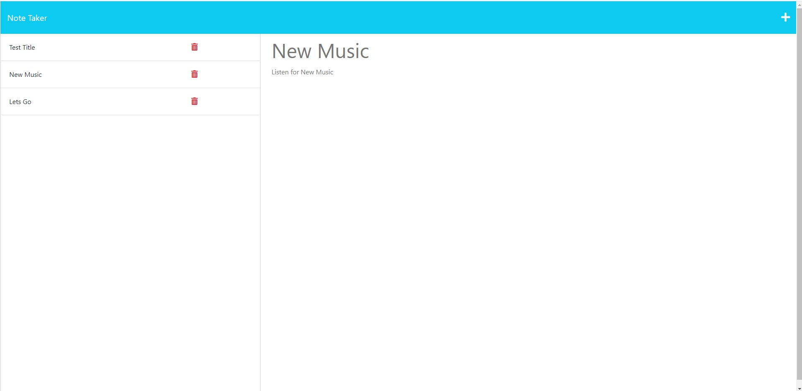

# Expressage-in-a-Bottle

This is an app developed to allow a user to to record a note that they can keep track of with a given title. Notes are saved to and kept tracked of via an Express.js backend that utilizes a JSON file.

From the landing page, users are able to navigate to the main Notes page; which displays all currently saved notes, as well as a blank note on the main display where the user can enter a new note. Entering new information into the blank fields gives the user the option to save the note; which writes the note to the attached JSON file, and displays the note's title along with the other notes in the database. Clicking any of these titles will cause that note to be displayed in the main display area.

